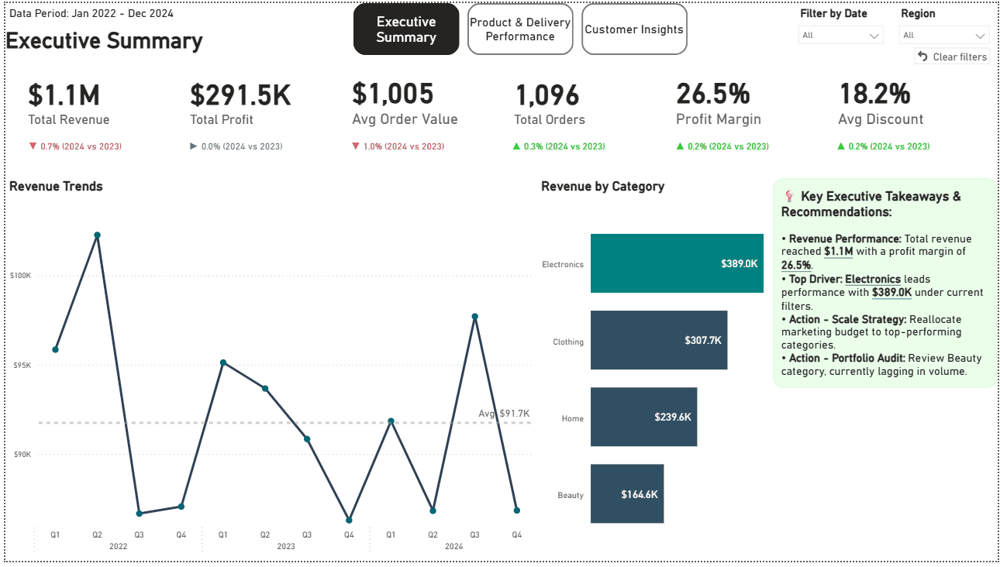
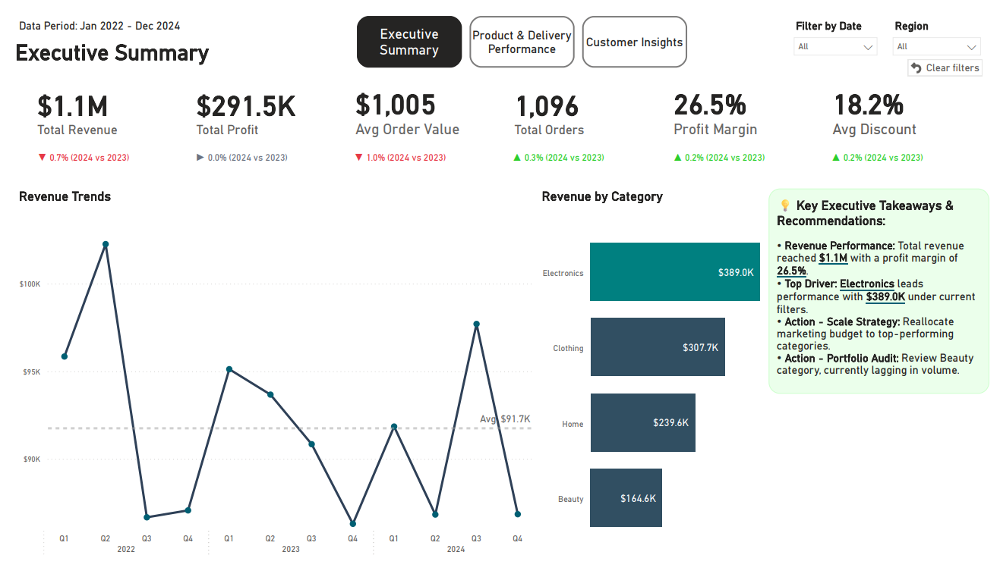
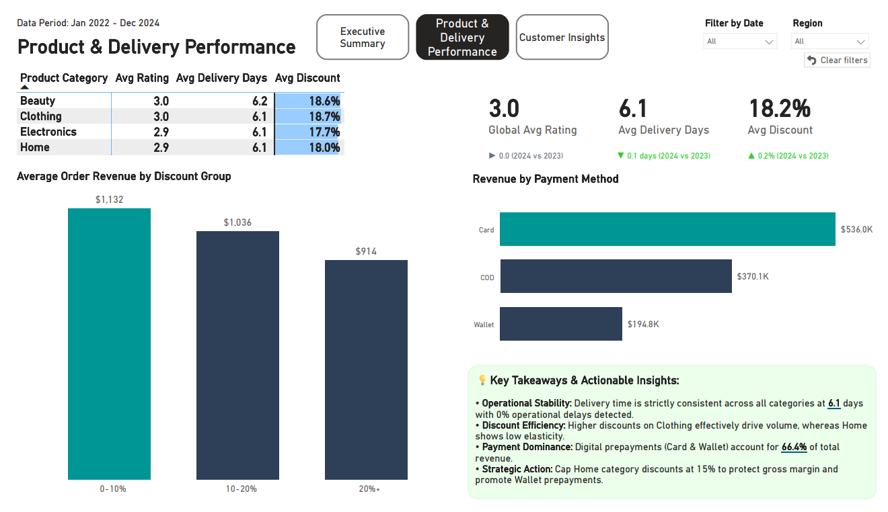
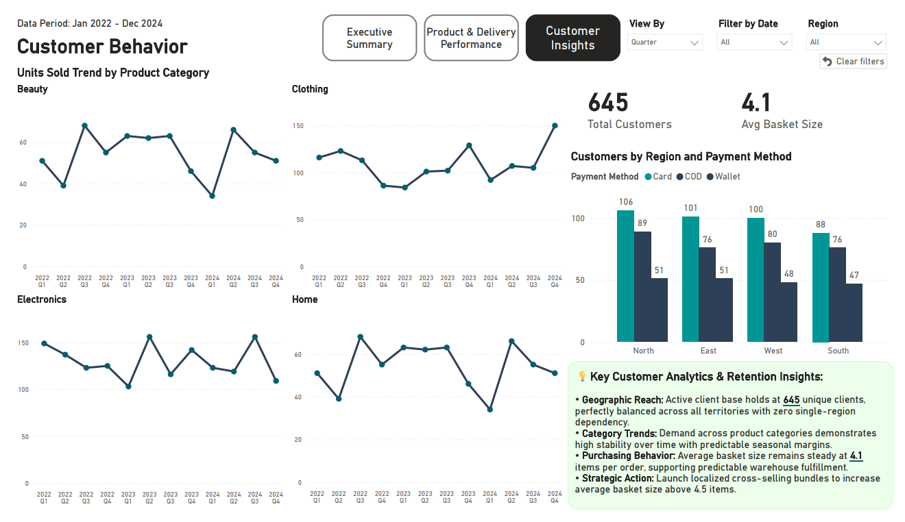
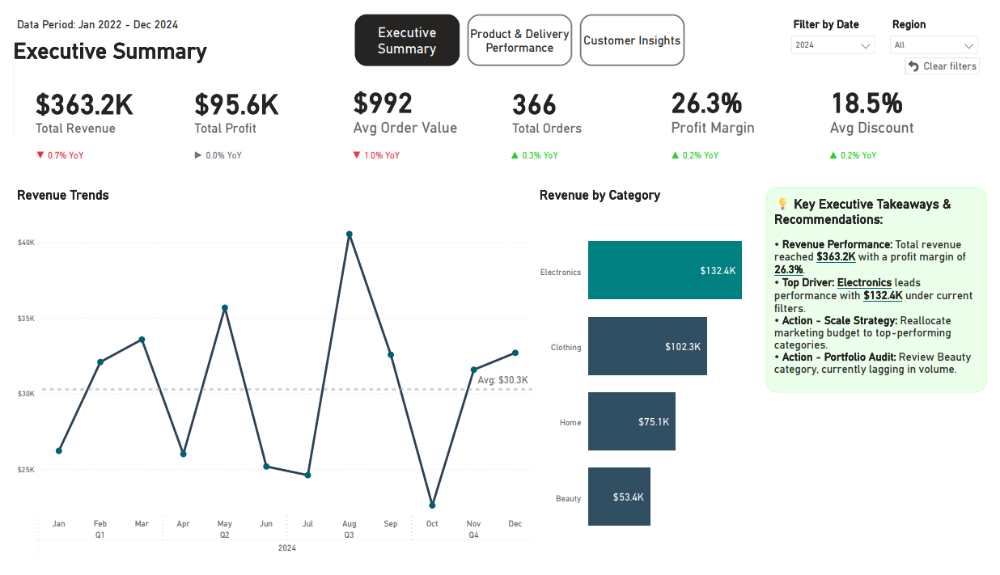
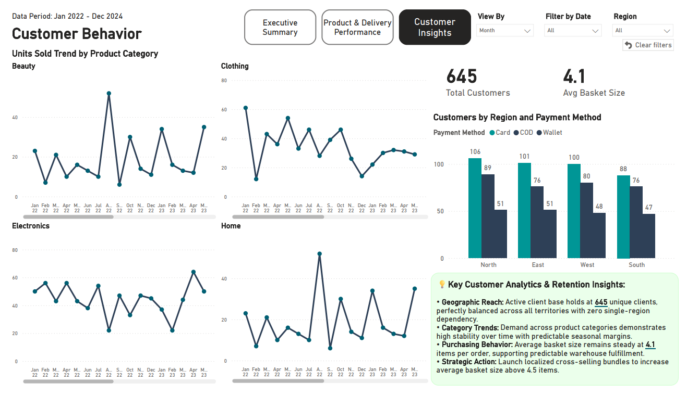
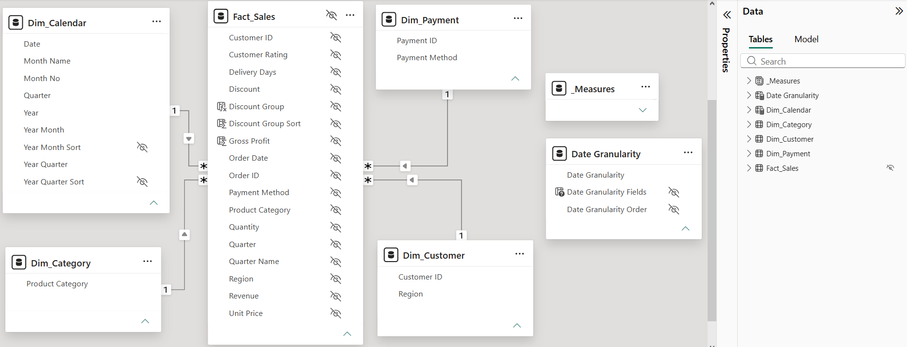

# Executive Sales & Operations Analytics Dashboard




---

An end-to-end, production-ready Power BI analytics solution designed for executive leadership, regional sales managers, and operations teams. This project transforms transactional retail data into dynamic, actionable insights with a strong focus on data storytelling, strict data hygiene, and VertiPaq engine optimization.

---

## 🔗 Live Demo & Project Assets
* **Power BI Project File:** [Download .pbix File](pbix/Executive_Sales_Operations_Analytics.pbix)
* **Author LinkedIn:** [Szymon Khrapachenko](https://www.linkedin.com/in/szymon-khrapachenko)

---

## 🖥️ Dashboard Architecture & Visual Design

The report consists of three strategic pages built with a strict visual hierarchy and high Data-Ink Ratio:

### 1. Executive Summary
* **Purpose:** High-level strategic oversight for C-suite executives.
* **Key Features:** Untruncated revenue trends (zero Y-axis baseline to prevent visual scaling bias), category performance breakdown, and dynamic **Smart Narratives** updating automatically upon slicing.



### 2. Product & Delivery Performance
* **Purpose:** Operational deep-dive into discount efficiency, delivery SLAs, and payment channels.
* **Key Features:** Category-level fulfillment matrix, revenue by discount group, and automated strategic action items (e.g., margin protection logic for low-elasticity categories).



### 3. Customer Behavior & Demographics
* **Purpose:** Geographic distribution and purchasing pattern analysis.
* **Key Features:** Small Multiples (`Units Sold Trend`) to avoid cluttered line charts, cross-territory customer breakdown (645 active unique clients, 4.1 avg basket size), and regional payment preferences.



<details>
<summary>🔍 Click to view Dynamic Filtering & Granularity Switching Examples</summary>

### Dynamic Smart Narrative Recalculation (Filtered by 2024)


### Field Parameters Granularity Switch (View by Month)


</details>

---

## 🏗️ Data Architecture & Hygiene

The data model follows a clean, single-direction **Star Schema** optimized for memory footprint and DAX measure performance:

```text
                          +-------------------+
                          |   Dim_Calendar    |
                          +---------+---------+
                                    |
                                    | 1:N
                                    v
+-----------------+  1:N  +-------------------+  1:N  +------------------+
|  Dim_Category   |------>|    Fact_Sales     |<------|   Dim_Payment    |
+-----------------+       +---------+---------+       +------------------+
                                    ^
                                    | 1:N
                          +---------+---------+
                          |   Dim_Customer    |
                          +-------------------+
```



## 📊 Dataset Specifications & Scale
* **Source:** E-Commerce Sales Analytics (Kaggle Retail Dataset).
* **Volume:** 5,000 transactional order records filtered to a 3-year historical period (2022–2024).
* **Granularity:** Order line-item level integrating Customer Demographics, Operational Logistics (Delivery Days & SLAs), Financial Metrics (Revenue, Discounts), and Payment Methods.
* **Architecture:** Raw transactional file cleaned in Power Query and transformed into a 5-table Star Schema (`Fact_Sales`, `Dim_Calendar`, `Dim_Category`, `Dim_Customer`, `Dim_Payment`).

## Best Practices & Model Governance

* **Developer-Centric Source Control:** Formatted as Power BI Project (`.pbip`) utilizing TMDL/BIM schema structure for clean Git diff tracking, pull request code reviews, and seamless team collaboration.
* **Row-Level Security (RLS):** Implemented territorial data isolation (`Regional_Manager_North`, `South`, `East`, `West`) via DAX filters on `Dim_Customer[Region]` to restrict data access based on user roles.
* **Zero Implicit Measures:** All raw numeric fact fields in Fact_Sales are explicitly hidden from the end-user interface to enforce the use of centralized Explicit Measures.
* **Organized Repository:** All DAX code resides in an isolated _Measures table, structured with numbered display folders (01_KPIs, 02_YoY Logic, 03_Formatting & Colors, 04_Dynamic Axes).
* **VertiPaq Optimization:** Single-direction 1:N relationships with integer surrogate keys for efficient dictionary encoding and high compression ratios.
* **Field Parameters:** Integrated Date Granularity disconnected parameter table for dynamic temporal aggregation (Quarter/Month/Year).

## 💻 DAX Showcase
**1. Robust Time-Intelligence & Year-Selection Fallback**

Calculates YoY Revenue change with an automated fallback mechanism (COALESCE + MAX Sales Year) ensuring text insights never return BLANK when no explicit calendar slicers are applied:

```dax
Revenue YoY Formatted = 
VAR SelectedYear = SELECTEDVALUE('Dim_Calendar'[Year])
VAR MaxSalesDate = MAX('Fact_Sales'[Order Date])

VAR CurrentYearRev = 
    IF(
        ISFILTERED('Dim_Calendar'[Year]),
        [Total Revenue],
        CALCULATE([Total Revenue], 'Dim_Calendar'[Year] = YEAR(MaxSalesDate))
    )

VAR PreviousYearRev = 
    IF(
        ISFILTERED('Dim_Calendar'[Year]),
        CALCULATE([Total Revenue], SAMEPERIODLASTYEAR('Dim_Calendar'[Date])),
        CALCULATE([Total Revenue], 'Dim_Calendar'[Year] = YEAR(MaxSalesDate) - 1)
    )

VAR YoY = DIVIDE(CurrentYearRev - PreviousYearRev, PreviousYearRev, BLANK())
VAR YearLabel = IF(NOT ISFILTERED('Dim_Calendar'[Year]), " (" & YEAR(MaxSalesDate) & " vs " & (YEAR(MaxSalesDate) - 1) & ")", " YoY")

RETURN
IF(
    ISBLANK(YoY),
    "",
    SWITCH(
        TRUE(),
        ABS(YoY) < 0.0005, "► 0.0%" & YearLabel,
        YoY > 0, "▲ " & FORMAT(YoY, "0.0%", "en-US") & YearLabel,
        "▼ " & FORMAT(ABS(YoY), "0.0%", "en-US") & YearLabel
    )
)
```

**2. Programmatic UI Data-Driven Color Accent**

Automates chart highlighting by dynamically identifying the highest-performing category in the current filter context and applying an accent HEX color (#008080) vs neutral base (#314F62):

```dax
Category Color Accent = 
VAR MaxRevenueInContext = 
    CALCULATE(
        MAXX(
            VALUES('Dim_Category'[Product Category]), 
            [Total Revenue]
        ), 
        ALLSELECTED('Dim_Category')
    )
VAR CurrentCategoryRevenue = [Total Revenue]
RETURN 
    IF(
        CurrentCategoryRevenue = MaxRevenueInContext, 
        "#008080",
        "#314F62"
    )
```

**3. Dynamic Axis Scaling with Safety Padding**

Dynamically calculates the upper Y-axis boundary across switching date granularities (Month/Quarter/Year), adding a 15% safety buffer (* 1.15) to prevent data label truncation on line charts:

```dax
Dynamic Y Max = 
VAR SelectedOrder = MAX('Date Granularity'[Date Granularity Order])

VAR MaxUnits = 
    SWITCH(
        SelectedOrder,
        2, MAXX(SUMMARIZE('Fact_Sales', 'Dim_Category'[Product Category], 'Dim_Calendar'[Year Month]), [Total Units Sold]),
        1, MAXX(SUMMARIZE('Fact_Sales', 'Dim_Category'[Product Category], 'Dim_Calendar'[Year Quarter]), [Total Units Sold]),
        0, MAXX(SUMMARIZE('Fact_Sales', 'Dim_Category'[Product Category], 'Dim_Calendar'[Year]), [Total Units Sold]),
        MAXX(SUMMARIZE('Fact_Sales', 'Dim_Category'[Product Category], 'Dim_Calendar'[Year Quarter]), [Total Units Sold])
    )

RETURN MaxUnits * 1.15
```

## 📁 Repository Structure

```text
├── Executive_Sales_Operations_Analytics.Report/         # Visual & Layout Configuration
├── Executive_Sales_Operations_Analytics.SemanticModel/  # Data Model, DAX & RLS Schema
├── Executive_Sales_Operations_Analytics.pbip            # Power BI Project Entry File
├── Executive_Sales_Operations_Analytics.pdf             # Executive Dashboard PDF Export
├── pbix/
│   └── Executive_Sales_Operations_Analytics.pbix        # Production Power BI Single File
├── screenshots/
│   ├── 01_executive_summary.png
│   ├── 02_product_delivery.png
│   ├── 03_customer_insights.png
│   ├── 04_executive_summary_filtered_2024.png
│   ├── 05_customer_insights_filtered_ViewByMonth.png
│   ├── 06_data_model.png
│   └── GifProjekt_1.gif                                  # Interactive Demo
└── README.md                                             # Project Documentation
```

## 🛠️ Technical Stack

**BI Platform: Power BI Desktop**

**Language: DAX (Data Analysis Expressions)**

**Modeling: Dimensional Modeling (Star Schema)**

**Version Control: Git / GitHub**
